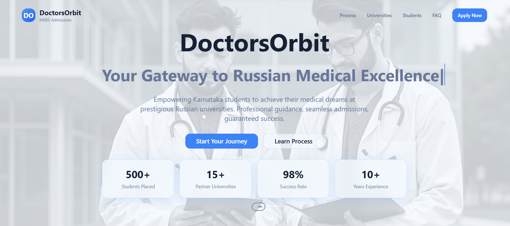
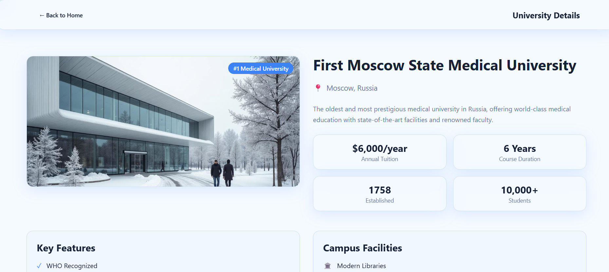

# Doctors Orbit 🌍🩺

A simple web platform built with **HTML, CSS, and JavaScript** to help students connect with opportunities for pursuing **MBBS seats in Russia**.  

---

## 🚀 About

Doctors Orbit acts as an information and guidance hub for students aspiring to study medicine abroad (specifically in Russia).  
It provides students with details about MBBS programs, available seats, and helps them connect with the right resources.  

---

## ✨ Features

- Clean and responsive UI (HTML + CSS)  
- Interactive sections built with JavaScript  
- Provides details about Russian MBBS programs and seats  
- Contact / inquiry form for students  
- Easy navigation and user-friendly design  

---

## 🛠️ Tech Stack

- **Frontend**: HTML, CSS, JavaScript  
- **Deployment**: GitHub Pages / Vercel / Netlify  

---

## 📸 Screenshots

_Add screenshots of your project UI here (homepage, forms, etc.). Example:_  

  
  

---

## ⚡ Getting Started

You don’t need any frameworks or compilers — just a browser.

### Steps

1. Clone the repository:
   ```bash
   git clone https://github.com/Vineetsu/doctors_orbit.git
